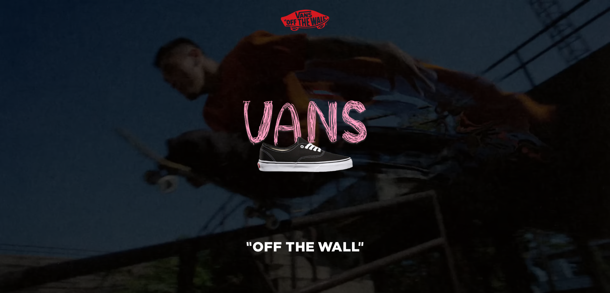

# 반스 홈페이지 리디자인 프로젝트

### 0. 반스 리디자인 홈페이지

##### 사용 기술 :       

##### 작업 기간 : 2023.5.25 ~ 2023 9.25 (4 Month)

##### 작업 유형 : 개인 프로젝트 (기여도 - 100%)


### [프로젝트 바로가기](https://frdytheme.github.io/VansRedesign)

---

### 1. 이 프로젝트를 통해 얻고자 하는 게 무엇인가?

- 이전 프로젝트에서 공공 api를 통해 작업해봤으니 이번엔 직접 api용 백엔드 서버를 만들어 쇼핑몰 페이지를 구현해보고 싶었다.
  <br>
- 디자인 단계부터 코딩을 통한 기능 구현으로 하나의 웹사이트를 완성시키는 과정을 직접 해보고 싶었다.

---

### 2. 프로젝트를 하며 느낀 점

- 전에는 공부를 위해 필요한 기능을 직접 구현하려 했지만, 복잡한 기능은 라이브러리를 통해 구현하는 게 프로젝트 효율을 높이는 방법일 수 있다는 것을 배웠다.
  <br>
- 혼자 디자인, 프론트엔드, 백엔드 작업을 해보니 서로 협업하는 게 정말 중요하다고 느꼈다. 결국 하나의 프로젝트를 위해 연결되어있기에 원활한 의사소통을 통해 작업 효율을 높이고 코드의 수정을 염두에 두고 관리하기 편하게 작성하는 것도 중요하다는 걸 배웠다.
  <br>
- 이번에 jwt토큰과 bcrypt 라이브러리를 사용해봤는데 실제 프로젝트를 배포한다면 단순히 로그인이 되는 걸 넘어 보안 관리 또한 매우 중요하는 걸 느꼈다.

---

## 3. 디렉토리 구조


---

## 4. 디자인 의도

##### 개인적으로 반스는 '캐주얼', '오리지널리티', '매니악'을 모두 가진 브랜드라고 생각한다.

대표적인 모델인 '올드 스쿨' '어센틱' '스케이트-하이' 등 모델의 실루엣은 유지하면서 다양한 브랜드, 디자이너와의 콜라보를 통해 믹스매치된 텍스쳐와 과감한 프린팅을 전개했고, 스케이트 보더들과 단화를 좋아하는 대중들에게 모두 사랑받는 브랜드가 되었다고 생각한다.

#### - Intro

_기존 실루엣은 유지하면서 디자인의 변화를 주는 반스의 이미지처럼 폰트의 형태는 다르지만 본질은 변하지 않음을 표현하기 위해 같은 크기의 텍스트가 연속으로 나오며 VANS 텍스트가 움직이는 것처럼 작업했다._



#### - Home

_반스의 모델을 살펴보면 단순한 형태지만 신발의 각 부분마다 디자인에 변화를 줘서 하나의 새로운 제품을 보여주는 것처럼 각 페이지의 콘텐츠를 그리드로 블럭이 쌓인 듯 배치해서 하나의 웹페이지를 구성했다._


#### - Product

_Home과 마찬가지로 사각형의 블록 형태로 제품 콘텐츠들을 배치했고, 스크롤에 따라 제품이 로딩되기 때문에 사용자 편의를 위해 좌측에 필터 영역을 고정했다._


#### - Other

_반스가 가진 캐쥬얼과 오리지널리티의 느낌을 어떻게 표현할까 하다가 웹사이트지만 앱을 이용하는 듯한 느낌을 주기 위해 제품 상세 페이지, 이벤트 페이지는 페이지가 넘어가지 않고 독립된 컨텐츠 박스가 슬라이드되며 등장하도록 디자인했고<br>가시성이 필요한 요소에는 반스의 대표 컬러인 레드 포인트 컬러를 적용시켰다._

<div style="display: flex; flex-direction: row;">
  
  
</div>

---

## 5. 주요 기능

#### - 쇼핑몰을 모바일이나 탭으로 이용하는 유저를 고려한 반응형 웹사이트
*좌측부터 PC, 태블릿, 모바일 버전*

<div style="display: flex; justify-content: space-around;">
  
  
  
</div>

<br>

#### - 원하는 제품을 찾기 위한 필터와 검색 기능

<div style="display: flex; flex-direction: row;">
  
  
</div>

<br>

#### - 비슷한 제품, 모델의 다양한 컬러를 배치해서 빠른 이동.


<br>

#### - 이메일 인증을 통한 회원 가입, ID / PW 찾기 기능


<br>

#### - 회원 로그인 시 기존 장바구니 연동, 비어 있다면 현재 담은 장바구니와 동기화.


<br>

#### - 컨텐츠를 가리지 않도록 장바구니 이동 알림 타이머 기능


---

### 6. 문제 및 해결

#### - jwt토큰이 쿠키로 넘어오지 않는다.
*로그인 기능 구현 중 jwt토큰을 쿠키로 저장해서 인증하는 방식으로 구현하고 싶었다. 서버에서 토큰을 발행해주는 건 네트워크 Set-Cookie탭을 통해 확인했지만 브라우저 애플리케이션 탭의 쿠키 저장소에는 쿠키가 저장이 안되는 문제.*

<div style="display:flex; gap:10px; flex-direction:column;">
<aside style="background-color: #f1f1f1; border: 1px solid #d1d1d1; padding:20px;">
<p style="font-weight: bold; font-size: 18px;">❓원인</p>
개발 브라우저로 크롬을 사용중이었기에 서버에서 쿠키를 발행할 때 쿠키의 옵션 중 sameSite 속성이 문제일 거다, 도메인이 달라서 안되는 거다, secure 속성을 꼭 포함하여야 한다 등등 여러가지 케이스를 찾아보며 적용해봤고 최종적으로 해결한 건
CORS 관련 문제였다.

</aside>

<aside style="background-color: #D0E7D2; border:1px solid #d1d1d1; padding:15px;">
<p style="font-weight: bold; font-size: 18px;">✅ 해결</p>
WithCredentials 속성을 서버와 클라이언트 모두 true로 설정해주고 해결할 수 있었다.
<br>
<br>
처음에는 http 환경에서 쿠키 전달과 저장이 아예 안되는 줄 알고 mkcert로 인증서를 받아 개발 환경 자체를 https로 바꾸고 쿠키 설정을 이래저래 바꿔가며 다시 하는 과정을 겪기도 했다.
</aside>
</div>

<br>

```jsx
import axios from "axios";

const authApi = axios.create({
  baseURL: "https://vans-redesign-frdytheme.koyeb.app/api",
  withCredentials: true,
});

export default authApi;

// api통신용 모듈.js
```

```jsx
app.use(
  cors({
    origin: "https://frdytheme.github.io", // 허용할 도메인 주소
    credentials: true, // 쿠키 전달을 허용
  })
);

// 서버의 index.js
```

---

#### - 보안이 중요한 키는 .env 파일에 보관하라면서 github에 올리면 안된다고? 그럼 어디서 키를 불러오는 거지?

*jwt토큰이나 gmail OAuth 기능을 구현하다가 개발 환경에서 .env파일을 사용해 시크릿 키를 보관하는 것을 알게 되었다. 또 .env 파일은 보안을 위해 github에 백업을 추천하지 않는다고 하는데...그럼 배포는 어떻게 하지?*

<div style="display:flex; gap:10px; flex-direction:column;">
<aside style="background-color: #f1f1f1; border: 1px solid #d1d1d1; padding:20px;">
<p style="font-weight: bold; font-size: 18px;">❓원인</p>
이 문제는 프로젝트를 마무리하고 배포하면서 알게 되었는데
백엔드를 구축하는 건 처음이었기 때문에 배운 대로 깃허브 페이지로 배포할 예정이었지만, github pages는 정적인 웹 페이지를 호스팅하기 위한 서비스로, 동적 데이터베이스를 배포하기에 적합한 환경이 아니라서 서버용 배포 서비스를 찾아야했다.
</aside>

<aside style="background-color: #D0E7D2; border:1px solid #d1d1d1; padding:15px;">
<p style="font-weight: bold; font-size: 18px;">✅ 해결</p>
서버를 배포하기 위해 무료인 서비스를 찾다가 koyeb을 알게 됐고 서버를 배포할 때 사용하는 서비스에는 .env에 보관하는 시크릿 키를 서버에 보안 저장하는 기능이 있는 걸 알게 됐고 문제를 해결할 수 있었다.
</aside>
</div>


---

### 폴더마다 이미지 개수가 다른데 알아서 출력할 수 있을까

*완전 무료인 서버 배포 서비스를 찾지 못해서 용량이 큰 편인 이미지 파일들을 서버에 저장하지 못하고 클라이언트 프로젝트에 저장해야 했다. 문제는 모델마다 이미지 개수가 달랐기 때문에 코드를 통해 폴더에 존재하는 이미지들을 불러와 화면에 출력하고 싶었다.*

<div style="display:flex; gap:10px; flex-direction:column;">
<aside style="background-color: #D0E7D2; border:1px solid #d1d1d1; padding:15px;">
<p style="font-weight: bold; font-size: 18px;">✅ 해결</p>
당장 해결한 방법은 node로 이미지 폴더를 탐색해서 폴더명과 파일명을
json파일로 정리하고 그걸 연결해서 해결했지만

새로운 정보가 추가되면 해당 과정을 반복해야 하기 때문에 비효율적이다.
더 나은 방법을 찾게 되면 적용 시켜보기로 하고 일단 넘어갔다.
</aside>
</div>


```jsx
// 폴더를 탐색해 json파일로 만든 코드

const fs = require("fs");
const path = require("path");

const imagesFolder = "./public/product"; // 이미지 폴더 경로
const outputJsonFile = "./imageInfo.json"; // 생성할 JSON 파일 경로

function getImageInfo(folderPath) {
  const imageInfo = {};
  const subFolders = fs.readdirSync(folderPath);

  subFolders.forEach((subFolder) => {
    const subFolderPath = path.join(folderPath, subFolder);
    const isSubFolder = fs.lstatSync(subFolderPath).isDirectory();

    if (isSubFolder) {
      const images = fs.readdirSync(subFolderPath);
      const imagesInfo = images.map(
        (image) => `/images/product/${subFolder}/${image}`
      );

      imageInfo[subFolder] = imagesInfo;
    }
  });

  return imageInfo;
}

const imageInfoData = getImageInfo(imagesFolder);

// Write the image info to a JSON file
fs.writeFileSync(outputJsonFile, JSON.stringify(imageInfoData, null, 2));

console.log("json 작성 성공", outputJsonFile);
```


---

### 모바일 버전에서 제품 리스트를 들어갔을 때 불필요한 스크롤 동작 발생

*제품이 스크롤에 따라 로딩 되는데 제품 컨테이너와 홈이 간헐적으로 번갈아 스크롤 되면서 불편함이 발생*

<div style="display:flex; gap:10px; flex-direction:column;">
<aside style="background-color: #f1f1f1; border: 1px solid #d1d1d1; padding:20px;">
<p style="font-weight: bold; font-size: 18px;">❓원인</p>
너무 여러 컴포넌트의 이해관계가 얽혀있어서 정확한 원인은 찾지 못했지만
홈 컴포넌트의 아래에 생긴 의문의 여백 때문에 발생하는 문제라서
overflow-hidden을 적용했으나 상세 페이지의 스크롤까지 막히는 문제 발생.
</aside>

<aside style="background-color: #D0E7D2; border:1px solid #d1d1d1; padding:15px;">
<p style="font-weight: bold; font-size: 18px;">✅ 해결</p>
홈 컴포넌트에 현재 위치가 제품 페이지인지 && 제품 상세 페이지가 꺼져 있는지 && 모바일 환경인지 조건식으로 클래스를 적용해 overflow: hidden을 주고 해결했다.
</aside>
</div>

<br>

```jsx
// 홈 컴포넌트
<HomeSection className={isMobile && !detailBtn && isProductPage ? "noScroll" : ""} >

// styled-components
@media (max-width: 768px) {
  &.noScroll {
    overflow: hidden;
  }
}
```

---

### - 프로젝트 후기

#### 프로젝트에 협업이 중요한 이유를 몸소 체험했다.

이번 프로젝트를 끝마치며 하나의 웹사이트를 구성하기 위해서는 개개인의 역량도 중요하지만 팀 단위의 소통과 호흡이 더 중요하지 않을까 생각하게 됐다. 부족한 실력으로 더디게 쌓아올린 결과물이지만 더 견고한 구조를 갖춘 프로젝트를 만들기 위해 어떤 방식으로 소통하면 좋을 지 조금은 느낄 수 있는 작업이었다. 기회가 생긴다면 지금의 경험을 활용해 모든 파트가 잘 짜여진 팀 프로젝트를 해보고 싶다.


### [프로젝트 바로가기](https://frdytheme.github.io/VansRedesign)
